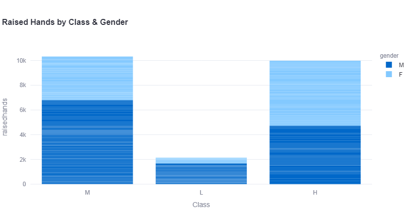

# School Dashboard

This project is an interactive dashboard built using Streamlit and Plotly.

## Features
- Student academic performance analysis
- Interactive charts
- Filter options for class and subject
- Download charts as PNG

## Tech Stack
- Python
- Streamlit
- Pandas
- Plotly

## How to run
pip install -r requirements.txt  
streamlit run app.py

## Dashboard Preview

### Plot 1

### Plot 2
.png)

### Plot 3
.png)

